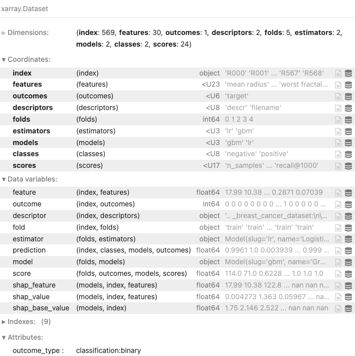

# xrml
[](https://github.com/related-sciences/xrml/actions/workflows/build.yml)

This library adds a variety of utility functions for applying machine learning (ML) operations over data modeled with an Xarray dataset specification.  The purpose of `xrml` is to do little more than suggest this format as a substrate for application-specific ML pipelines, and then implement a few common operations on top of it.  This is advantageous because most ML pipelines produce a variety of datasets with shared dimensions and a typically dense or mostly dense structure, which lends well to N-dimensional array representation.  For example, these pipelines may operate on features, outcomes, and models to produce performance statistics, predictions and explanations for those predictions all while also preserving metadata fields and other informative, non-quantitative details.  None of this is easy to do with a libraries like Pandas or numpy alone.

Here is example usage:

```python
import shap
import xrml as xl
import numpy as np
import pandas as pd
from sklearn.linear_model import LogisticRegression
from sklearn.preprocessing import StandardScaler
from sklearn.ensemble import GradientBoostingClassifier
from sklearn.pipeline import make_pipeline
from sklearn.datasets import load_breast_cancer


data = load_breast_cancer()

# Load a standard scikit-learn dataset with features and some binary outcome
df = (
    pd.DataFrame(data['data'], columns=data['feature_names'])
    .assign(target=data['target'])
    .assign(row_id=lambda df: [f'R{i:03d}' for i in range(len(df))])
    .assign(filename=data['filename'])
    .assign(descr=data['DESCR'])
)

# Convert this to Xarray via `xrml` and run some ML models on it
ds = (
    df
    .pipe(
        xl.create_dataset,
        # Index rows using the generated row_id
        index=['row_id'], 
        # Choose columns that contain outcomes
        outcomes=['target'],
        # Set some fields that provided metadata about training
        # samples without needing to push them into an index
        descriptors=['filename', 'descr']
    )
    # Set CV strategy
    .pipe(xl.add_stratified_splits, n_splits=5)
    # Choose estimators
    .pipe(xl.add_models, estimator_fn=lambda: [
        xl.Model(
            'lr', 'Logistic Regression', 
            make_pipeline(StandardScaler(), LogisticRegression(random_state=0))
            .set_output(transform="pandas")
        ),
        xl.Model(
            'gbm', 'Gradient Boosting',
            make_pipeline(GradientBoostingClassifier(random_state=0))
            .set_output(transform="pandas")
        )
    ])
    # Run cross-validation
    .pipe(xl.run_cv, predict_fn=xl.predict_proba, score_fn=xl.score_classification)
    # Add SHAP explanations
    .pipe(xl.explain, model='gbm', tree_shap_check_additivity=False)
)
ds
```



Now it's convenient to access all this information via the generated `Dataset`, and some examples of this are in [examples.ipynb](doc/notebook/examples.ipynb).
